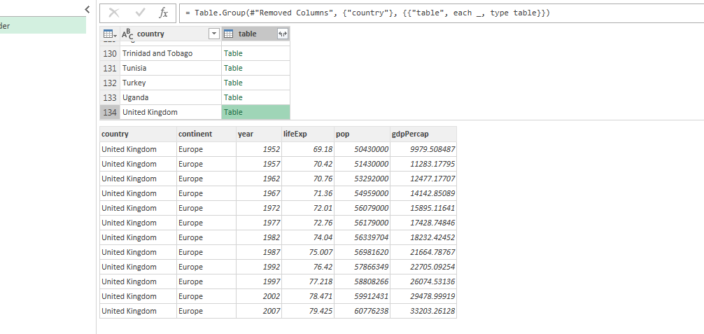

```{r include=FALSE}
library(tweetrmd)
```
```{r echo=FALSE, layout="l-body-outset", preview=TRUE}

```


## Intro
In this blog post, I'll try to highlight some of Excel's functionality which have been around for a while, but remains largely unknown to the broad public.

Now, I'll be the first one to throw rocks at the Excel camp. I've got receipts:

```{r echo=FALSE}
tweet_embed("https://twitter.com/taraskaduk/status/962376095323643910")
tweet_embed("https://twitter.com/taraskaduk/status/970708905251737605")
tweet_embed("https://twitter.com/taraskaduk/status/935263135413555203")
```

However, I'll also be the first to jump in Excel's defense whenever an opportunity presents itself:

```{r echo=FALSE}
tweet_embed("https://twitter.com/taraskaduk/status/946035002571218944")
```

What gives? I generally agree that Excel is a bad way to conduct an analysis. Having said that, there are many enhancements to the product (Windows version mainly) that came out over the last 10 years which are completely overlooked by both Excel users and Excel bashers. One of such enhancements, Power Query (or Query Editor, or M language), allows for a reproducible data import and transformation, and is quite easy to learn. That will be this post's topic.

### What this post isn't about

- Excel cell formulas
- VBA
- Power Pivot and data modeling
- DAX and Excel / Power BI measures
- Power Query's and M's history
- full functionality of Power Query
- Excel on a Mac

### The audience
This post isn't a guide to using Excel's and Power BI's Power Query. This post is not for people who want to learn new cool tricks of Excel.

This post is for data scientists and analysts who put reproducible analysis (achieved via programming one's analysis in R or Python) at the center of what they do. This post is for people who like to use Excel as a punching bag (and again, I am one of those people).

Lastly, this post is for those analysts stuggling to switch the workflow at their place of work from Excel to R or Python. I think that Power Query could act as a gateway drug to reproducible analysis. Meet them where they're at (in Excel), and guide them by hand out into the world of "programming your analysis".

## Power Query
Power Query, a.k.a. Data Explorer, a.k.a. Query Editor is Microsoft's module within Excel and Power BI which allows users to perform data import and transformations before loading the ready tables into a workbook. It's been around since 2013. Google for more information.

### Components
In the simplest terms possible, I could break the Power Query down into two parts: the language and the GUI. 

#### The M language
From [MSDN](https://msdn.microsoft.com/en-us/library/mt211003.aspx):

> The Power Query M formula language is optimized for building highly flexible data mashup queries. It's a functional, case sensitive language similar to F#

In simpler terms, it is a data transformation language. Now, I'm not a computer scientist, and won't be able to explain all the technical details well, therefore I suggest that the most interested ones go and check out the [Power Query M language specification](https://msdn.microsoft.com/en-us/library/mt807488.aspx). For the rest of us, I'll just say that M works by calling a function on a table or a list, then storing this result as a new table, and then calling this new table in the next step with another function. That is oversimplification, of course, but for the purpose of this post, it should do.

##### Example 1
Let me explain it on an example. 
In Excel, I created sample table of 3 rows and 3 columns called `df`. 


I then loaded it into the query editor, and pressed a few buttons. Here is the code it generated (I edited the step names and indented the lines):

```
let
    Source = Excel.CurrentWorkbook(){[Name="df"]}[Content],
    change_type = Table.TransformColumnTypes(Source,
                                            {
                                              {"a", Int64.Type}, 
                                              {"b", Int64.Type}, 
                                              {"c", Int64.Type}
                                            }),
    filter = Table.SelectRows(change_type, each ([a] <> 7)),
    remove_cols = Table.RemoveColumns(filter,{"c"})
in
    remove_cols
```
The final output will look like this:


The first step, `Source`, is our import step. It tells Power Query where to find our table.
The second step, `change_type"`, is auto-generated. Notice that it references the first step as the first argument of the function `Table.TransformColumnTypes`: it says *"that's the table we will work with"*. All this step does is assigns columns a, b and c the type of integer.
Next step, `filter`, references the previous step, and performs a filter operation.
Finally, `remove_cols` takes the result of the previous step, and then removes a column.
Then, the code tells Power Query that the result of `remove_cols` is the one to be printed.

This is a very basic explanation of how this code works. You can twist it, bend it to your will, skip steps, branch out, use parameters etc. But the common functionally is this stitched *freight train*-like sequence of steps.

##### Example 2
Here is the data transformation sample from [David Robinson's](https://twitter.com/drob) [DataCamp course on the tidyverse](https://campus.datacamp.com/courses/introduction-to-the-tidyverse/data-wrangling-1?ex=12)

```{r eval = FALSE}
library(gapminder)
library(dplyr)

gapminder %>%
  filter(year == '2007') %>%
  mutate(lifeExpMonths = 12 * lifeExp) %>%
  arrange(desc(lifeExpMonths))
```

I hope I don't need to read to you what it does (if you can't read the code, try running it. If you have no idea what's going on here - I suggest taking the above-mentioned David's class on the tidyverse)

Here is how I'd solve the same simple task in Power Query.
First, Power Query in Excel, unlike Power Query in Power BI, can't run R scripts, therefore I can't just load a package. But Power Query can read `.RData` files. It can also load stuff from the web. We'll do just that

```
let
    Source = Web.Page(
                Web.Contents("https://github.com/jennybc/gapminder/blob/master/inst/extdata/gapminder.tsv")),
    Data = Source{0}[Data],
    col_types = Table.TransformColumnTypes(Data,{
                                                  {"", type text}, 
                                                  {"country", type text}, 
                                                  {"continent", type text}, 
                                                  {"year", Int64.Type}, 
                                                  {"lifeExp", type number}, 
                                                  {"pop", Int64.Type}, 
                                                  {"gdpPercap", type number}
                                                }),
    filter = Table.SelectRows(col_types, each ([year] = 2007)),
    mutate = Table.AddColumn(filter, "lifeExpMonths", each [lifeExp] * 12, type number),
    arrange = Table.Sort(mutate,{{"lifeExpMonths", Order.Descending}})
in
    arrange
```

Now, again, I changed the names of the steps and indented the code for readability purposes. The rest was generated by Power Query and I was just clicking on things. I want to stress it out again: **I didn't have to know any of the functions, any of the syntax**. All I did was:

- Pass a web link into GUI.
- From there, Power Query figured out that it needed a combo of `Web.Page(Web.Contents())` to get to the data. It saw a table and guessed column types for me.
- From here, I clicked on the "year" column header to filter it, clicked a button to create a new column out of the old one, and the clicked on its header to sort in descending order.

In other words, _I came to this with no pre-existing knowledge of coding, and got myself a reproducible piece of code_. The data refreshes upon each load: Excel will be checking Jenny's GitHub page every time we refresh the data, and will be applying the steps as documented.


### The GUI
As you may have guessed from my previous paragraph, the Query Editor GUI is bread and butter of this whole scheme: the M language itself is hard to type by hand, the functions are long, it is case sensitive, and there is no good source code editor (Notepad++ and other text editors do a better job than the Power Query itself). 
But I feel like Power Query wasn't built to program in: that's not the main customer base of Excel and Power BI.
What Power Query is good at is its GUI that allows users to click around and apply data transformation steps, all the while generating a script behind the scenes.

First, there is a ribbon with several tabs and plenty of buttons to click on. Some represent very simple existing functions, while others are pretty complicated and generate a solid chunk of code on just one click.


Next, you are allowed to interact with your data to some extend. You can't edit any cells, but you can filter columns, move them around, fill them down, sort, and so on, within the table itself. Power Query will pick up on your actions and will save your transformations in a script.


You can have more than one query, coming from different sources, and you can make them interact with each other: merge (join), append (union), reference, split, nest and so on.

You can also re-arrange the query steps in the GUI via simple drag-n-drop, and your script will be re-written to reflect the new order.

## What I like about Power Query

There are quite a few things I like about Power Query:

- **Learning curve.** It's easy to get started with Power Query and create functional reproducible scripts out of the gate. The powerful GUI allows for that. No setup necessary: no installation, fine tuning, no ODBC drivers and connections. It just works out of the box. Almost like it wasn't Microsoft creating it.
- **Accessing data.** Getting the data is the most seamless experience I've had. It has pre-built functions for many data sources (I've got receipts: [here is the list of functions](https://msdn.microsoft.com/en-US/library/mt296615.aspx)), and can recognize a large amount of data formats. It doesn't require any ODBC setup. The Power Query flavor that runs on Power BI can also use **R scripts** as a data source or a data step, yet this functionality isn't a part of Excel yet.
- **Tidy-like data storage and display.** Surprised? Yeah, with a few exceptions, Power Query treats everything as a data frame. What if it's not a data frame? Then it tries to fit the data into a rectangular shape. I'd like to show a few examples.

Here is an example of how Power Query treats JSON files. I used the well-known (thanks to Jenny Bryan's tutorials!) [API of Ice and Fire](https://anapioficeandfire.com/).
Here is what I've got after a few clicks. Note that I only plugged in the API call as a URL - Power Query did the rest.


It is a data frame, but it has a nested list column for titles. Neat!

Not only JSON records get nested. You could have a nested table (can happen upon a join or after a `group_by`-like call), or a nested list. Regardless, Power Query will always try to make your data rectangular, which is pleasing to any `tidyverse` adept. Here is another example. I took the same Gapminder dataset, and nested it, grouping by `country`. The table above is now how Power Query sees the table. The data frame below is a sneak peek into one of the nested cells for the United Kingdom. The function up on top is the step I applied to nest the data frame:



One more example. Here is how Power Query sees a folder full of files:


Likewise, if you told Power Query to access a database, and didn't specify SQL statement, it would return a data frame of all tables and views in that database, and you can take it from there.

- *Robust GUI that keeps the code.* Another cool feature is that the GUI can handle 90% of one's needs, and it scripts all transformations behind the scenes. I think of it as a gateway drug to *"programming one's analysis"*

## What I don't like about Power Query

- **Speed.** It is unbelievably slow. I guess the convenience comes at a cost of performance. It does well on small datasets and simpler operations, but fails to do a decent job the moment you scale.
- **Syntax and flexibility.** The language is rather rigid, and the syntax is annoying at times.
- **Limits.** It can only do so much. You can import and transform the data, but you can't do anything else here.

## Conclusion

What we have these days is several generations of knowledge workers trained on doing their analysis in Excel. Just bashing the tool is not productive. We think we provide better alternatives with R or Python, but we frequently forget about the learning curve associated not only with learning a new language, but also with learning **a language** for the first time.
Excel's Power Query could serve as an important stepping stone in taking the analysis out of the Wild West world of Excel VLOOKUPs into the world of reproducible code, git repos and other warm and fuzzy things.