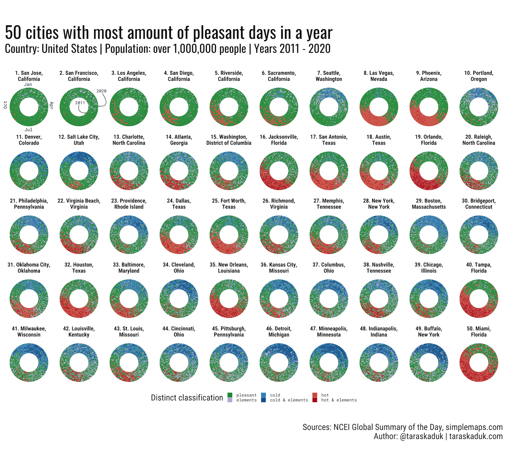
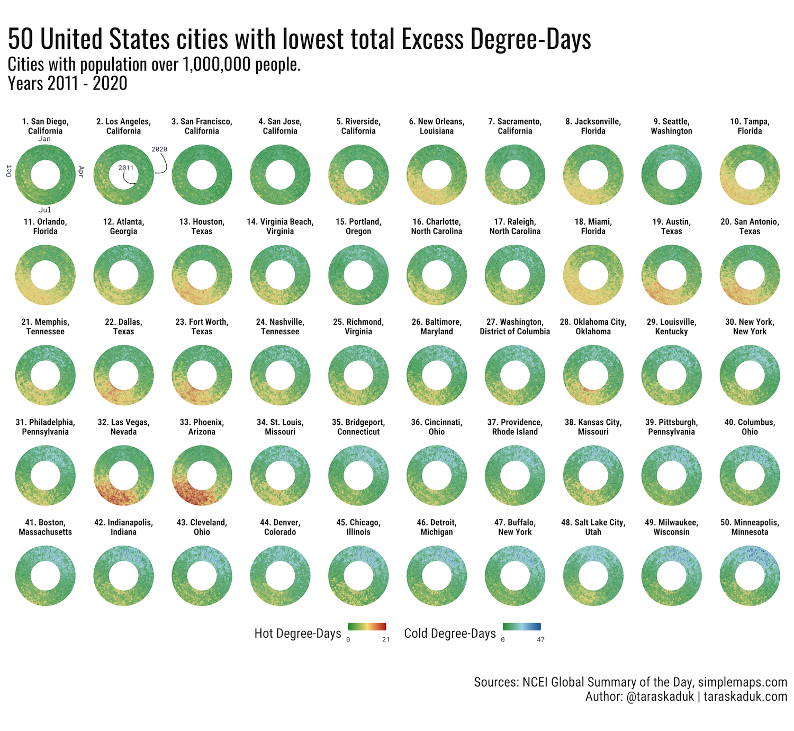
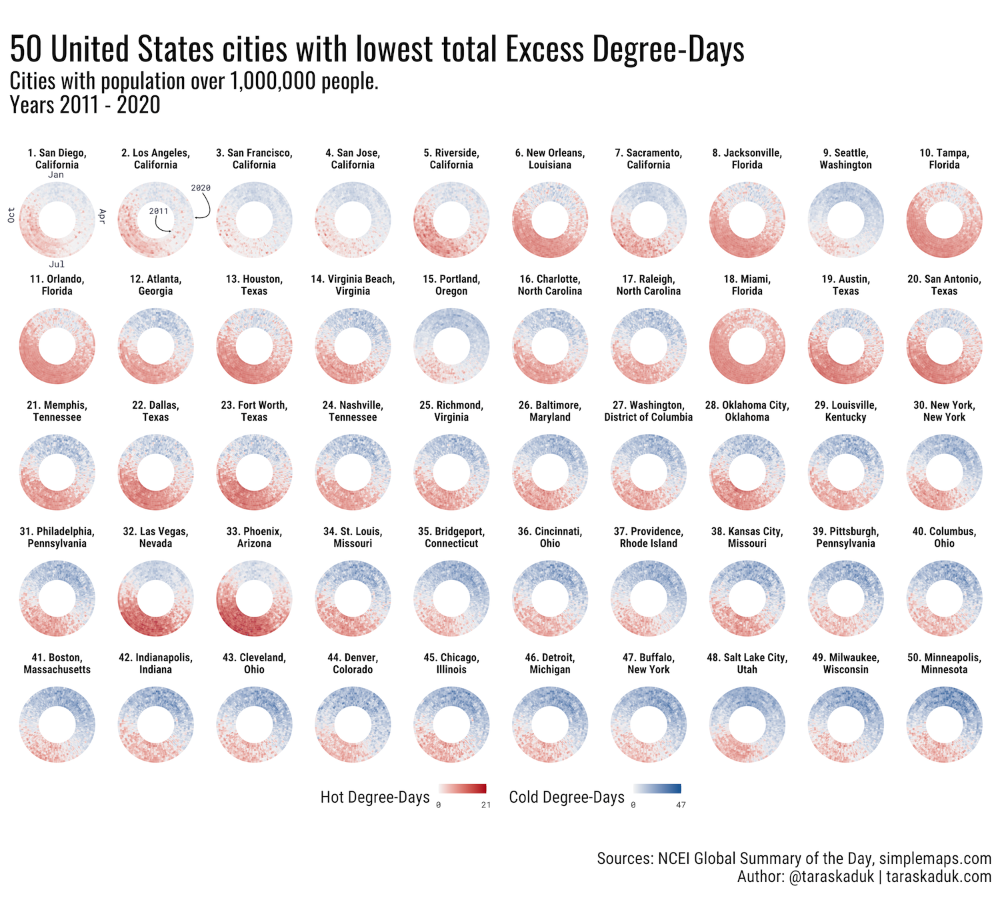

```{r setup, include=FALSE}
knitr::opts_chunk$set(
	echo = FALSE,
	error = FALSE,
	message = FALSE,
	warning = FALSE
)
```

## Summary

In this post, I examine NCEI's GSOD (Global Summary of the Day) data [@gsod] and attempt to determine which cities in the world, as well as in the United States, have the most pleasant weather for human habitation.

Following my earlier blog posts ["Where are the places with the best (and the worst) weather in the United States?"](https://taraskaduk.com/posts/2019-02-18-weather/) and ["Measuring Excess Degree-Days in the Context of Location Comfort and Liveability"](https://taraskaduk.com/posts/2019-11-11-excess-degree-days/), this post will rank U.S. and world cities using two separate approaches: my original approach to classify each day as pleasant or not (hot, cold, having precipitation), as well as my calculation of excess degree-days.

**The classification of days into distinct categories of pleasant / hot / cold / elements** is easier from a communication standpoint, i.e. it is more intuitive. The main problem with it, however, is in its key feature: it creates distinct categories out of continuous variables. Not only that, it also employs several such breaks, each of which is arbitrary to some extend, and the final result of checking every day against this set of parameters being even more arbitrary. 

For this ranking, I have expanded my original criteria to account for a greater range of people's perceptions of weather. A pleasant day will thus be determined as one where:

- lowest temperature was above 0°C (32°F) but not higher than 20°C (68°F)
- highest temperature was above 10°C (50°F) but not higher than 35°C (95°F)
- no significant amount of precipitation

**The calculation of excess degree-days**, on the other hand, is the reverse side of the previous algorithm in term of benefits and drawbacks. While it is much less intuitive and more complex in calculation (using trigonometry and integral calculus), it is a continuous scale that doesn't create arbitrary breaks. Additionally, it only requires one baseline input, and while it can be somewhat subjective as to what a baseline temperature should be, the change in the baseline does not sway the calculation too much, keeping the ranking mostly in order.
Aside from all this, however, the Excess Degree-Days metric (or EDD for short) does not incorporate the rain/snow variable, and only focuses on the daily temperatures.


For this ranking, the baseline and the calculations are in line with the [above cited post](https://taraskaduk.com/posts/2019-11-11-excess-degree-days/): 18°C (64.5°F) is the starting point.

## Results

Each chart is a ranking of 50 cities, best or worst, with #1 spot being best or worst, respective of the ranking (best of all best 50 or worst of all worst 50). Both "Pleasant days" and "Excess Degree-Days" charts are provided. Furthermore, "Excess Degree-Days" is rendered in two versions red-yellow-green-blue gradient, as well as colorblind-friendly red-white-blue gradient.

Each circle depicts 10 years, from 2011 through 2020, with 2011 as innermost layer and 2020 as outermost, with days moving clockwise from January 1 at 12:00 position, April 1 at 3:00 position, and so on.


### Best world cities

These are the rankings of cities with the best weather: most pleasant days / lowest total excess-degree days.

```{r echo=FALSE, layout="l-page"}
knitr::include_graphics("figures/50_most_world_1000_10_pleasant.png")
knitr::include_graphics("figures/50_most_world_1000_10_edd2.png")
knitr::include_graphics("figures/50_most_world_1000_10_edd.png")
```

### Worst world cities

These are the rankings of cities with the worst weather: fewest pleasant days / highest total excess-degree days.

While the "best" cities overlap between the two rankings, this is clearly not the case for the other side: in the "pleasant days" ranking, we see all the cities with hot climate year-round, while the EDD ranking shows us mostly cold cities. This is due to the fact that while each day in the hottest climate can be too warm to be pleasant or comfortable, the temperature does go up as much as it goes down. I.e. a very cold day in Siberia is many more degrees away from human comfort than a very hot day in Southeast Asia.

This is not a flaw in the post, but rather a feature, and this discrepancy is a live illustration of a different mechanism of the two metrics.

```{r echo=FALSE, layout="l-page"}
knitr::include_graphics("figures/50_least_world_1000_10_pleasant.png")
knitr::include_graphics("figures/50_least_world_1000_10_edd2.png")
knitr::include_graphics("figures/50_least_world_1000_10_edd.png")
```

### Largest world cities

In the final "World" segment, rather than finding "best" or "worst" cities by each metric,
I isolated 50 most populous cities first, and then ranked them accordingly, best to worst. 

```{r echo=FALSE, layout="l-page"}
knitr::include_graphics("figures/50_most_world_0_10_pleasant.png")
knitr::include_graphics("figures/50_most_world_0_10_edd2.png")
knitr::include_graphics("figures/50_most_world_0_10_edd.png")
```

### World cities data table

```{r}
library(rnaturalearth)
library(rmarkdown)
library(rnaturalearthdata)
library(sf)
library(kgc)
library(lubridate)
library(scales)
library(ggnewscale)
library(tidyverse)

source(Sys.getenv("theme_url"))
theme_set(theme_tk())
caption <-  "Sources: NCEI Global Summary of the Day, simplemaps.com\nAuthor: @taraskaduk | taraskaduk.com"

summary_locations <- readRDS("summary_locations.RDS") %>% 
  filter(!(city %in% c("Bronx","Manhattan","Brooklyn", "Queens"))) 
```

#### Pleasant days in world cities over 1,000,000 people

```{r echo=FALSE, layout="l-body-outset"}
summary_locations %>% 
  filter(population > 1000000) %>% 
  select(city, country, population, pleasant, hot, cold, elements, unknown) %>%
  arrange(desc(pleasant), desc(population)) %>% 
  paged_table()
```

#### Excess Degree-Days in world cities over 1,000,000 people

```{r echo=FALSE, layout="l-body-outset"}
summary_locations %>% 
  filter(population > 1000000) %>% 
  select(city, country, population, edd_total, edd_hot, edd_cold) %>%
  arrange(edd_total, desc(population)) %>% 
  paged_table()
```

#### Pleasant days in world cities over 500,000 people

```{r echo=FALSE, layout="l-body-outset"}
summary_locations %>% 
  select(city, country, population, pleasant, hot, cold, elements, unknown) %>%
  arrange(desc(pleasant), desc(population)) %>% 
  paged_table()

```

#### Excess Degree-Days in world cities over 500,000 people

```{r echo=FALSE, layout="l-body-outset"}
summary_locations %>% 
  select(city, country, population, edd_total, edd_hot, edd_cold) %>%
  arrange(edd_total, desc(population)) %>% 
  paged_table()
```

### United States

For the United States, there are 46 metro areas that are over 1,000,000 people (according to the data from simplemaps.com), and therefore I simply decided to get 50 largest total cities: this way, "cities over 1M people with best weather" and "most populous cities ranked" are the same chart, while "worst weather" ranking is the same chart read backwards: #50 to #1.

```{r echo=FALSE, layout="l-page"}



```

### United States cities data tables

#### Pleasant days in United States cities over 1,000,000 people 

```{r echo=FALSE, layout="l-body-outset"}
summary_locations %>% 
  filter(population > 1000000 & country == "United States") %>% 
  select(city, admin_name, population, pleasant, hot, cold, elements, unknown) %>%
  arrange(desc(pleasant), desc(population)) %>% 
  paged_table()
```

#### Excess Degree-Days in United States cities over 1,000,000 people 

```{r echo=FALSE, layout="l-body-outset"}
summary_locations %>% 
  filter(population > 1000000 & country == "United States") %>% 
  select(city, admin_name, population, edd_total, edd_hot, edd_cold) %>%
  arrange(edd_total, desc(population)) %>% 
  paged_table()
```

#### Pleasant days in United States cities over 500,000 people 

```{r echo=FALSE, layout="l-body-outset"}
summary_locations %>% 
  filter(country == "United States") %>% 
  select(city, admin_name, population, pleasant, hot, cold, elements, unknown) %>%
  arrange(desc(pleasant), desc(population)) %>% 
  paged_table()
```

#### Excess Degree-Days in United States cities over 500,000 people 

```{r echo=FALSE, layout="l-body-outset"}
summary_locations %>% 
  filter(country == "United States") %>% 
  select(city, admin_name, population, edd_total, edd_hot, edd_cold) %>%
  arrange(edd_total, desc(population)) %>% 
  paged_table()
```


## Discussion

A person familiar with locations of many top cities in these ratings will recognize that many of these places are located in in rather specific zones: proximity a sea/ocean and elevation being two factors that deliver mild and pleasant climate.

Indeed, determining Köppen climate zones for all locations and then finding an average amount of pleasant days and average amount of excess degree-days shows that cities with most pleasant weather (by any of the two metrics) are located in Cwb (Subtropical highland) and Csb (Warm-summer Mediterranean) climate zones: both very mild temperate climates.


```{r}
summary_locations_zones <- data.frame(
    summary_locations,
    rndCoord.lon = RoundCoordinates(summary_locations$lon),
    rndCoord.lat = RoundCoordinates(summary_locations$lat)
  )

summary_locations_zones <- data.frame(summary_locations_zones, 
                                      climate_zone = LookupCZ(summary_locations_zones))

summary_zones <- summary_locations_zones %>% 
  group_by(climate_zone) %>% 
  summarise_at(.vars = c("pleasant", "edd_hot", "edd_cold", "edd_total"), .funs=mean) %>% 
  ungroup()

ggplot(summary_zones, aes(x=reorder(climate_zone, pleasant), y = pleasant))+
  geom_col()+
  coord_flip()  +
  labs(title = "Köppen climate zones rated by average amount of pleasant days",
       caption = caption
)

ggplot(summary_zones, aes(x=reorder(climate_zone, -edd_total), y = edd_total))+
  geom_col()+
  coord_flip() +
  labs(title = "Köppen climate zones rated by average excess degree-days",
       caption = caption
)
```

```{r layout="l-body-outset"}
world <- ne_countries(scale = "medium", returnclass = "sf") %>% 
  filter(name != "Antarctica")

summary_sf <- summary_locations %>% 
  st_as_sf(coords = c("lon", "lat"), crs = 4326)

col_hot <- "#B8001F"
col_hot_low <- "#FFBEC9"
col_cold <- "#0067A3"
col_cold_low <- "#BAE6FF"

p1 <- ggplot() +
  geom_sf(data = world, fill="grey90", col = "grey60", size=0.1)+
  geom_sf(data=summary_sf, 
          aes(col = pleasant),
          alpha=0.8,
          size=0.1) +
  scale_color_viridis_c(name = "Pleasant Days",
                        breaks = c(100,200,300), guide = "coloursteps", option = "B") +
  coord_sf(crs = "+proj=robin +lon_0=0 +x_0=0 +y_0=0 +ellps=WGS84 +datum=WGS84 +units=m +no_defs") +
  labs(title = "Spatial Distribution of Pleasant Days",
       caption = caption
)

p2 <- ggplot() +
  geom_sf(data = world, fill="grey90", col = "grey60", size=0.1)+
  geom_sf(data=summary_sf, 
          aes(col = edd_hot),
          size=0.1) +
        scale_colour_gradient2(name = "Hot Degree-Days", 
                            #trans="sqrt",
                            low="#1a9641", high=col_hot, mid = "#fee08b",
                            midpoint = max(summary_sf$edd_hot)/2,
                             breaks = c(round(min(summary_sf$edd_hot),0),
                                        max(summary_sf$edd_hot)/2,
                                        round(max(summary_sf$edd_hot),0)),
                             limits = c(round(min(summary_sf$edd_hot),0), 
                                        round(max(summary_sf$edd_hot),0))) +
  coord_sf(crs = "+proj=robin +lon_0=0 +x_0=0 +y_0=0 +ellps=WGS84 +datum=WGS84 +units=m +no_defs") +
  labs(title = "Spatial Distribution of Excess Hot Degree-Days",
       caption = caption
)

p3 <- ggplot() +
  geom_sf(data = world, fill="grey90", col = "grey60", size=0.1)+
  geom_sf(data=summary_sf, 
          aes(col = edd_cold),
          size=0.1) +
        scale_colour_gradient2(name = "Cold Degree-Days", 
                            #trans="sqrt",
                            low="#1a9641", high=col_cold,mid="#abd9e9",
                            midpoint = max(summary_sf$edd_cold)/2,
                             breaks = c(round(min(summary_sf$edd_cold),0),
                                        max(summary_sf$edd_cold)/2,
                                        round(max(summary_sf$edd_cold),0)),
                             limits = c(round(min(summary_sf$edd_cold),0), 
                                        round(max(summary_sf$edd_cold),0))) +
  coord_sf(crs = "+proj=robin +lon_0=0 +x_0=0 +y_0=0 +ellps=WGS84 +datum=WGS84 +units=m +no_defs") +
  labs(title = "Spatial Distribution of Excess Cold Degree-Days",
       caption = caption
)

p4 <- ggplot() +
  geom_sf(data = world, fill="grey90", col = "grey60", size=0.1)+
  geom_sf(data=summary_sf, 
          aes(col = edd_total),
          size=0.1) +
        scale_colour_viridis_c(name = "Total Degree-Days", 
                                option = "B",
                               direction = -1,
                             breaks = c(round(min(summary_sf$edd_total),0),
                                        max(summary_sf$edd_total)/2,
                                        round(max(summary_sf$edd_total),0)),
                             limits = c(round(min(summary_sf$edd_total),0), 
                                        round(max(summary_sf$edd_total),0))) +
  coord_sf(crs = "+proj=robin +lon_0=0 +x_0=0 +y_0=0 +ellps=WGS84 +datum=WGS84 +units=m +no_defs") +
  labs(title = "Spatial Distribution of Total Excess Degree-Days",
       caption = caption
)

ggsave("figures/map1.png", p1, width = 10, height=10*0.62, units = "in")
ggsave("figures/map2.png", p2, width = 10, height=10*0.62, units = "in")
ggsave("figures/map3.png", p3, width = 10, height=10*0.62, units = "in")
ggsave("figures/map4.png", p4, width = 10, height=10*0.62, units = "in")
```

```{r echo=FALSE, layout="l-page"}
knitr::include_graphics("figures/map1.png")
knitr::include_graphics("figures/map2.png")
knitr::include_graphics("figures/map3.png")
knitr::include_graphics("figures/map4.png")
```


## Methodology

All code required for this analysis can be found in the [taraskaduk/weather](https://github.com/taraskaduk/weather) repo. All analysis, with the exception of the plot generation, is written is a {drake} plan [@drake]. A more detailed post explaining the process is in the works, but in a meantime, the basic outline of the process is the following:

- identify locations of interest
- find nearest weather stations for each location using {GSODR} package [@gsodr]
- download and transform data for selected stations using a combination of base R and {GSODR}
- perform further clean-up and aggregation by location using numerous packages, including but not limited to {tidyverse} [@tidy], {sf} [@sf] and others
- apply "pleasant days" classification [@weather] and Excess Degree-Days calculation [@excess-degree-days], with the parameters listed in the Summary section of this post.